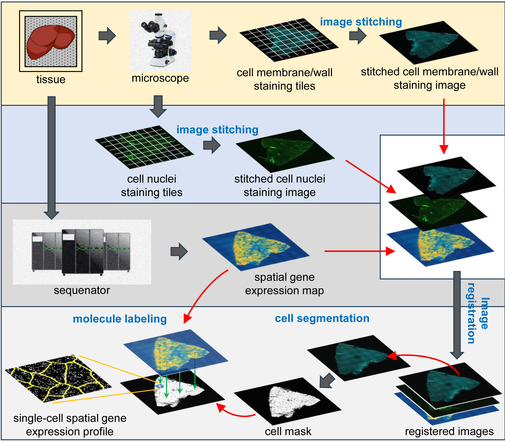

# STCellbin

## Introduction
STCellbin utilizes the cell nuclei staining image as a bridge to acquire cell membrane/wall staining image that align with spatial gene expression map. By employing advanced cell segmentation technique, accurate cell boundaries can be obtained, leading to more reliable single-cell spatial gene expression profile. The enhanced capability of this updating provides valuable insights into the spatial organization of gene expression within cells and contributes to a deeper understanding of tissue biology.

<div align="center">
  
    <h6>
      Generating single-cell gene expression profiles for high-resolution spatial transcriptomics based on cell boundary images
    </h6>
</div>
<br>

## Installation
STCellbin is developed by Python scripts. Please make sure Conda is installed before installation.

Download the [project resource code](https://codeload.github.com/STOmics/STCellbin/zip/refs/heads/main) and install requirements.txt in a python==3.8 environment.

```text
# python3.8 in conda env
git clone https://github.com/STOmics/STCellbin.git
conda create --name=STCellbin python=3.8
conda activate STCellbin
conda install pytorch==1.12.1 torchvision==0.13.1 torchaudio==0.12.1 -c pytorch
cd STCellbin-main
pip install -r requirements.txt # install
```

* The ```pyvips``` package needs to be installed separately. The following is referenced from [pyvips](https://libvips.github.io/pyvips/README.html#non-conda-install)

**On Windows**, first you need to use pip to install like,
```text
$ pip install --user pyvips==2.2.1
```
then you need to download the compiled library from [vips-dev-8.12](https://github.com/libvips/libvips/releases),
To set PATH from within Python, you need something like this at the start:

```python
import os
vipshome = 'c:\\vips-dev-8.7\\bin'
os.environ['PATH'] = vipshome + ';' + os.environ['PATH']
```

**On Linux**,
```text
$ conda install --channel conda-forge pyvips==2.2.1
```

## Tutorials

### Test dataset
The demo datasets have been deposited into Spatial Transcript Omics DataBase (STOmics DB) of China National GeneBank DataBase (CNGBdb) with accession number [STT0000048](https://db.cngb.org/stomics/project/STT0000048).

### Command Line
STCellbin in one-stop is performed by command:

```text
python STCellbin-main/STCellbin.py
-i /data/C01344C4,/data/C01344C4_Actin_IF
-m /data/C01344C4.gem.gz
-o /result
-c C01344C4
```

* ```-i``` Folder paths of cell nuclei staining image tiles and cell membrane/wall staining image tiles respectively.
* ```-m``` Compressed file of Stereo-seq spatial gene expression data.
* ```-o``` Output path.
* ```-c``` Chip number of Stereo-seq data.

## License and Citation
STCellbin is released under the MIT license.

Please cite STCellbin in your publications if it helps your research:

```text
B. Zhang et al. Generating single-cell gene expression profiles for high-resolution spatial transcriptomics based on cell boundary images. Preprint in bioRxiv. 2023.
```

## Reference
```text
M. Li et al. StereoCell enables highly accurate single-cell segmentation for spatial transcriptomics. Preprint in bioRxiv. 2023.
```
> https://github.com/matejak/imreg_dft <br>
> https://github.com/rezazad68/BCDU-Net <br>
> https://github.com/libvips/pyvips <br>
